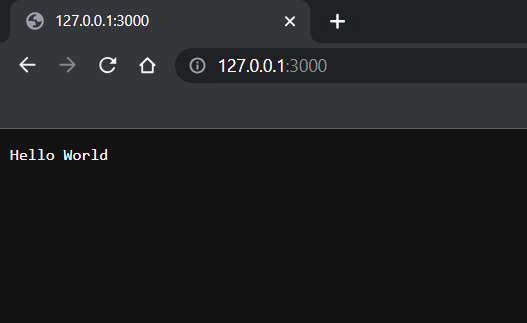

# Backend languages

The very first option that a developer needs to make when creating a project is what language and framework to use. There are many options such as .NET, Java, Python, PHP, Ruby, Node.js, Django, Laravel, Spring Boot, Rails, Express.js and more. Each of these options has its own advantages and disadvantages.

A backend developer needs to choose a language and framework that suits their project requirements, preferences and skills.

The choice for our backend was **Node.js.** A versatile, simple and suitable choice for our needs


# What is Node.js?

“Node.js is an open-source, cross-platform JavaScript runtime environment.”, this is the official definition we can find online, but what does it mean?

Node.js is based on Javascript, so it means we can “do backend” with **Javascript**!

We can download Node.js from the following link:

[Node.js](https://nodejs.org/en)

Here’s an example of a server written in Node.js.

```jsx
const http = require("http");

const hostname = "127.0.0.1";
const port = 3000;

const server = http.createServer((req, res) => {
  res.statusCode = 200;
  res.setHeader("Content-Type", "text/plain");
  res.end("Hello World");
});

server.listen(port, hostname, () => {
  console.log(`Server running at http://${hostname}:${port}/`);
});
```

To execute this we simply have to save this code in a Javascript file, say `server.js`, and execute it by opening a terminal in the same folder and writing the following command:

```bash
node server.js
```

Which will output:

```bash
node server.js
Server running at http://127.0.0.1:3000/
```

And if we visit that link:



We’ve just made our first Node.js server!
